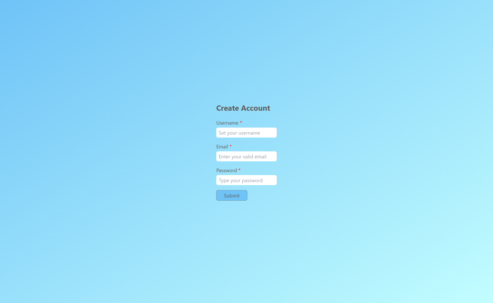
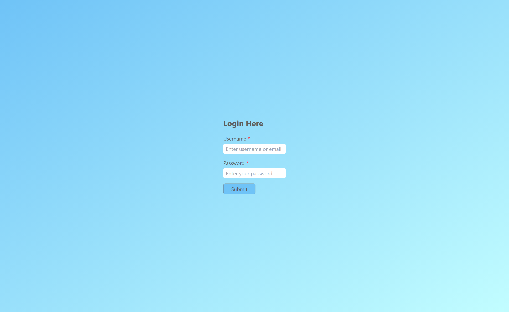
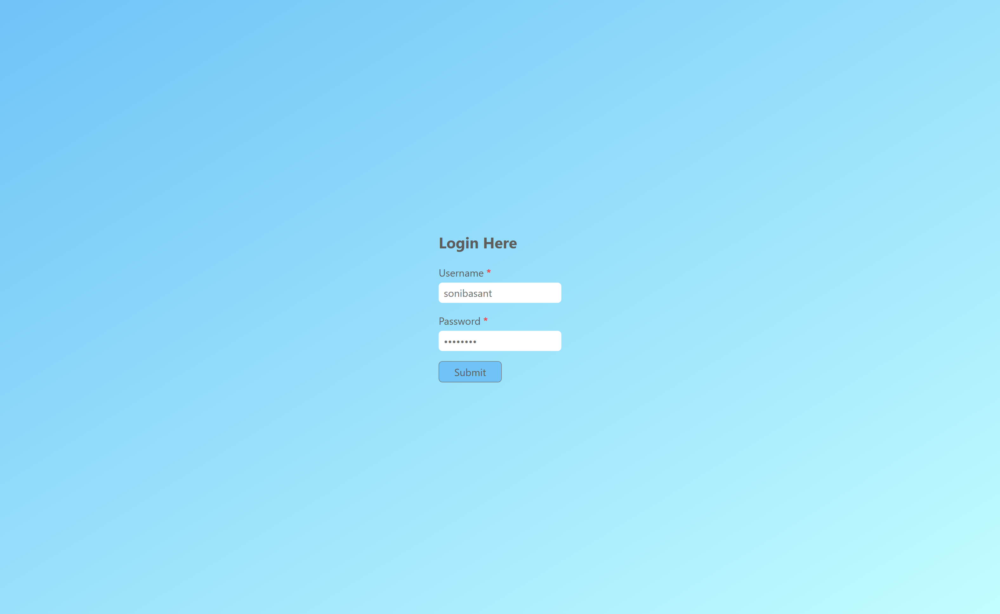

# A6. Login Form : Using LocalStorage and Tailwind

**Login form** is used in emails, news letters, social media accounts and all kind of subscriptions.

## Table of contents

- [Overview](#overview)
  - [Snapshots](#snapshots)
  - [Links](#links)
- [My process](#my-process)
  - [Built with](#built-with)
  - [Concepts Used](#concepts-used)
  - [Continued development](#continued-development)
  - [Useful resources](#useful-resources)
- [Author](#author)

## Overview

In this **Login Form**, first you need to enter your `Username`, `email ID` and `password` in **Create Account** page. When you click on _submit_ button, your data will be saved locally in local storage of your browser.

Also, a new page, **Login Here**, will open.

Here, first you need to enter either `username` or `email ID`. Then your `password`. An **alert** message will inform that your entries are correct or not.

**Local Storage:** Local storage can save your data, until you delete it or replace with other data. Data will NOT be deleted when you close browser. So you can access your saved data. It is helpful when security is not the concern.

### Snapshots

**Create Account Page :**

**Login Account Page :**

**Login Account Page : After entering data**

### Links

- Solution URL: [Source Code](https://github.com/SoniBasant/Vanilla-JavaScript-Projects/tree/main/A6-Login-form-with-localStorage-Tailwind)

- Live Site URL: [Live Link](https://sonibasant.github.io/Vanilla-JavaScript-Projects/A6-Login-form-with-localStorage-Tailwind/src/index.html)

## My process

### Built with

- Tailwind CSS

- Semantic HTML5 markup
- Vanilla JavaScript
- Flexbox
- Desktop-first workflow

### Concepts Used

- getElementById()

- addEventListener() > click
- .value
- if...else
- alert()
- Many Tailwind classes > bg-gradient, rounded-md etc.

Some **important** concepts -

- localStorage

- setItem()
- getItem()

### Continued development

Need to work on UI/UX, designs.

Your suggestions are welcome. 🙌

### Useful resources

- [w3schools](https://www.w3schools.com) - This helped me throughout my journey. Still doing. 🙂

- [Udemy](https://www.udemy.com/course/50-projects-50-days/) - On DOM part 🤝
- [freecodecamp](https://www.freecodecamp.org/) - All the problems I solved. Helped me a lot. 🙌
- [Tailwind docs](https://tailwindcss.com/) - For Tailwind Utility Classes

## Author

Basant Soni 👨‍💻

- GitHub - [@SoniBasant](https://github.com/SoniBasant)

- Frontend Mentor - [@SoniBasant](https://www.frontendmentor.io/profile/SoniBasant)
- CodePen - [@SoniBasant](https://codepen.io/sonibasant)
- Hashnode - [@SoniBasant](https://sonibasant.hashnode.dev/)
