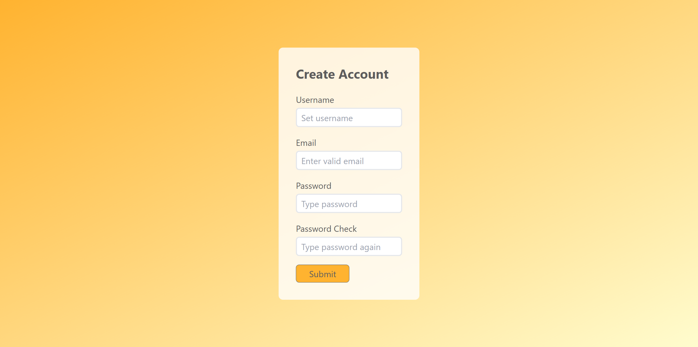
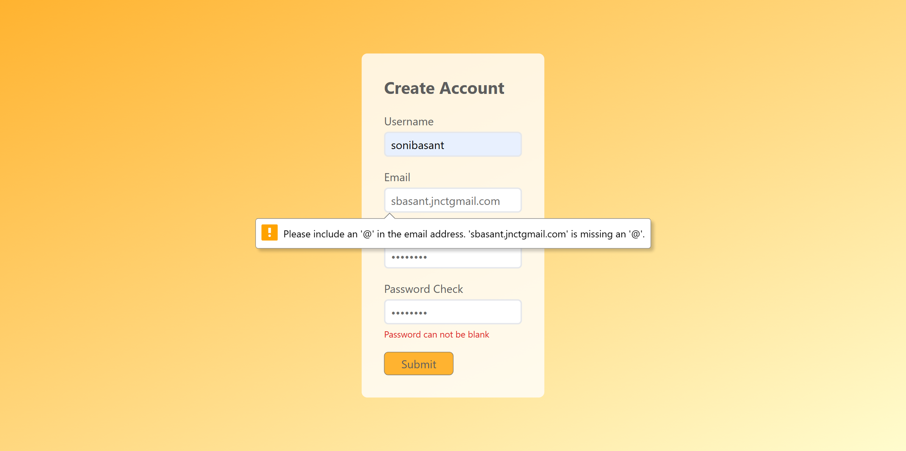
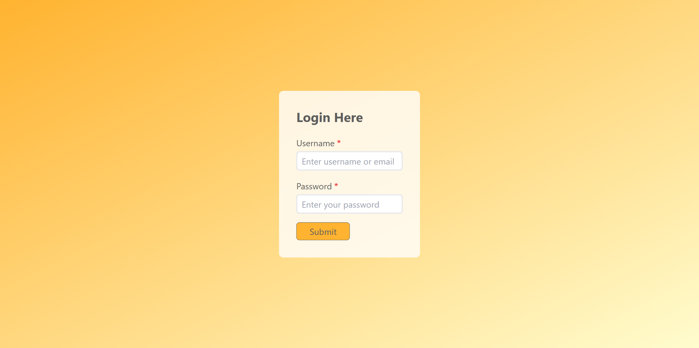

# A7. Login Form : Using SessionStorage, Validation and Tailwind

**Login form** is used in emails, news letters, social media accounts and all kind of subscriptions.

## Table of contents

- [Overview](#overview)
  - [Snapshots](#snapshots)
  - [Links](#links)
- [My process](#my-process)
  - [Built with](#built-with)
  - [Concepts Used](#concepts-used)
  - [Continued development](#continued-development)
  - [Useful resources](#useful-resources)
- [Author](#author)

## Overview

In this **Login Form**, first you need to enter your `Username`, `email ID` and `password` in **Create Account** page. Also, you need to type ` password` again to check it.

If you try to submit form without completing it, first you will an **alert** message to fill all entries, then all the empty inputs will show message like `Username can not be blank.`, `Email can not be blank` etc. Email should be in right format, otherwise you will error message.

When you click on _submit_ button, your data will be saved locally in session storage of your browser.

Also, a new page, **Login Here**, will open.

Here, first you need to enter either `username` or `email ID`. Then your `password`. An **alert** message will inform that your entries are correct or not.

**Session Storage :** It is different from local storage. It saves data only for the time till the browser window is open. As soon as you close it, your data will be erased. So, very useful where security is paramount.

### Snapshots

**Create Account Page :**

**Create Account Page : When email is not in format**

**Login Account Page :**

### Links

- Solution URL: [Source Code](https://github.com/SoniBasant/Vanilla-JavaScript-Projects/tree/main/A7-Login-Form-SessionStorage-Validation-Tailwind)

- Live Site URL: [Live Link](https://sonibasant.github.io/Vanilla-JavaScript-Projects/A7-Login-Form-SessionStorage-Validation-Tailwind/Reg.html)

## My process

### Built with

- Tailwind CSS

- Semantic HTML5 markup
- Vanilla JavaScript
- Flexbox
- Desktop-first workflow

### Concepts Used

- getElementById()

- querySelector()
- addEventListener() > click, submit
- .preventDefault()
- .value
- .trim()
- if...else
- classList.add
- classList.remove
- .innerText
- .parentElement
- alert()
- Many Tailwind classes > bg-gradient, rounded-md etc.

Some **important** concepts -

- sessionStorage

- setItem()
- getItem()
- RegEx for email validation
- window.location.href

### Continued development

Input border should be red or green as per validity of input.

Need to work on UI/UX, designs.

Your suggestions are welcome. 🙌

### Useful resources

- [w3schools](https://www.w3schools.com) - This helped me throughout my journey. Still doing. 🙂

- [Udemy](https://www.udemy.com/course/50-projects-50-days/) - On DOM part 🤝
- [freecodecamp](https://www.freecodecamp.org/) - All the problems I solved. Helped me a lot. 🙌
- [Tailwind docs](https://tailwindcss.com/) - For Tailwind Utility Classes

## Author

Basant Soni 👨‍💻

- GitHub - [@SoniBasant](https://github.com/SoniBasant)

- Frontend Mentor - [@SoniBasant](https://www.frontendmentor.io/profile/SoniBasant)
- CodePen - [@SoniBasant](https://codepen.io/sonibasant)
- Hashnode - [@SoniBasant](https://sonibasant.hashnode.dev/)
