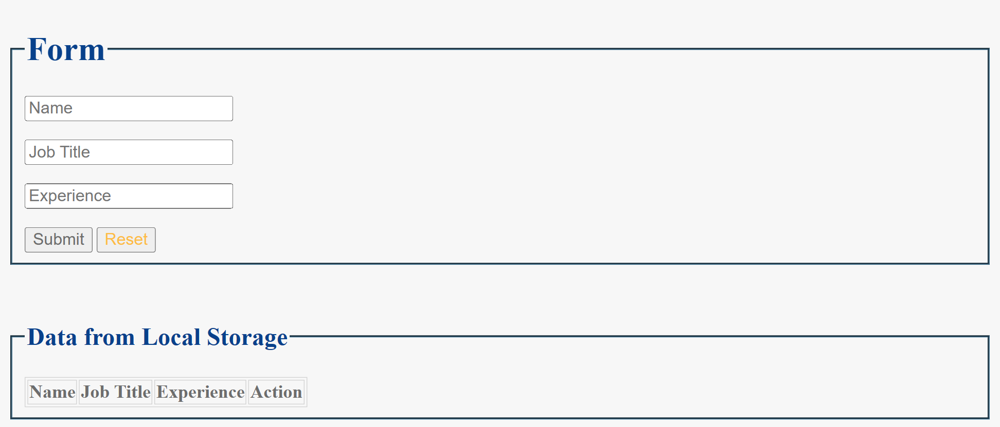
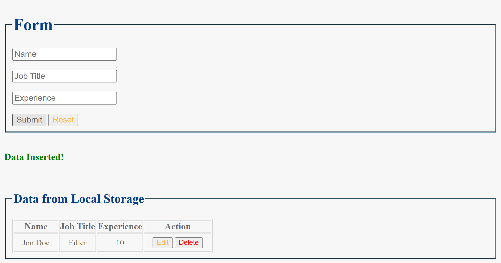
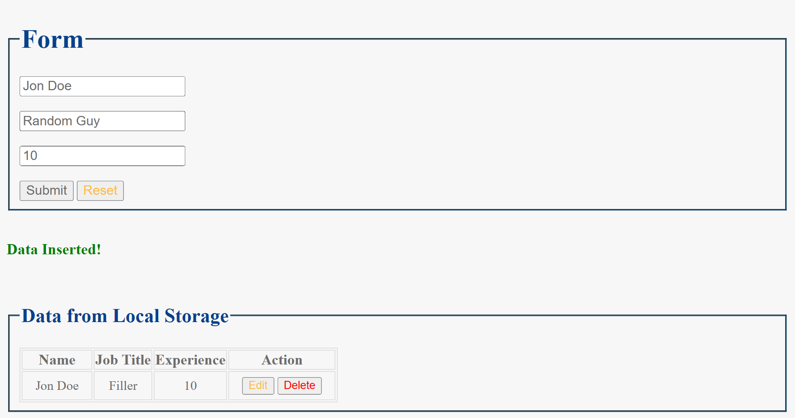
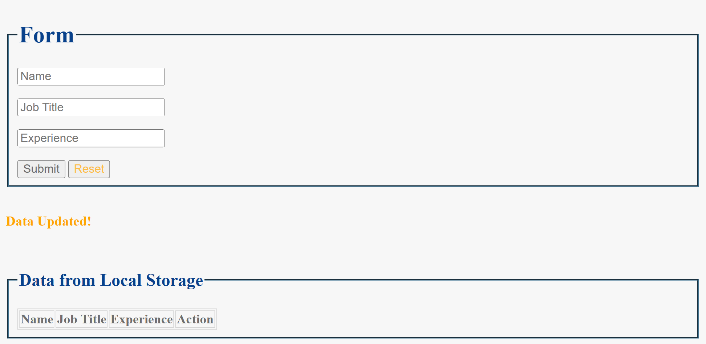

# A8. CRUD Form : Create Read Update Delete

**CRUD form** is to show all CRUD operations.

## Table of contents

- [Overview](#overview)
  - [Snapshots](#snapshots)
  - [Links](#links)
- [My process](#my-process)
  - [Built with](#built-with)
  - [Concepts Used](#concepts-used)
  - [Continued development](#continued-development)
  - [Useful resources](#useful-resources)
- [Author](#author)

## Overview

CRUD operations are very helpful when working with data. Here, in the form, you need to enter `Name`, `Job Title` and `Experience`; and then submit it.

Using localStorage, your data is visible on the screen with the option to `Edit` and `Delete` it.

When you click on `Edit` button and make changes as you want and submit it again, data will update.

With `Delete` button you can delete that row of data.

Both times, after Edit and Delete operations, you will get message. On Delete operation, you will get `confirm` alert also.

**Local Storage:** Local storage can save your data, until you delete it or replace with other data. Data will NOT be deleted when you close browser. So you can access your saved data. It is helpful when security is not the concern.

### Snapshots

**Primary form page :**

**Read data after Creating it :**

**During Update :**

**Delete data :**

### Links

- Solution URL: [Source Code](https://github.com/SoniBasant/Vanilla-JavaScript-Projects/tree/main/A8.%20CRUD%20Form)

- Live Site URL: [Live Link](https://sonibasant.github.io/Vanilla-JavaScript-Projects/A8.%20CRUD%20Form/crudForm.html)

## My process

### Built with

- Semantic HTML5 markup

- CSS custom properties
- Vanilla JavaScript
- Desktop-first workflow

### Concepts Used

- getElementById()

- Table
- addEventListener() > click, submit
- .value
- array methods > includes
- if...else
- .innerHTML
- .parentElement
- confirm()
- Template literals

Some **important** concepts -

- localStorage

- setItem()
- getItem()
- insertRow()
- insertCell()
- row.cells[]
- deleteRow()
- reset()

### Continued development

Not updating new data after deleting previous data, so need to correct it.

Need to work on UI/UX, designs, background etc.

Your suggestions are welcome. 🙌

### Useful resources

- [w3schools](https://www.w3schools.com) - This helped me throughout my journey. Still doing. 🙂

- [Udemy](https://www.udemy.com/course/50-projects-50-days/) - On DOM part 🤝
- [freecodecamp](https://www.freecodecamp.org/) - All the problems I solved. Helped me a lot. 🙌

## Author

Basant Soni 👨‍💻

- GitHub - [@SoniBasant](https://github.com/SoniBasant)

- Frontend Mentor - [@SoniBasant](https://www.frontendmentor.io/profile/SoniBasant)
- CodePen - [@SoniBasant](https://codepen.io/sonibasant)
- Hashnode - [@SoniBasant](https://sonibasant.hashnode.dev/)
