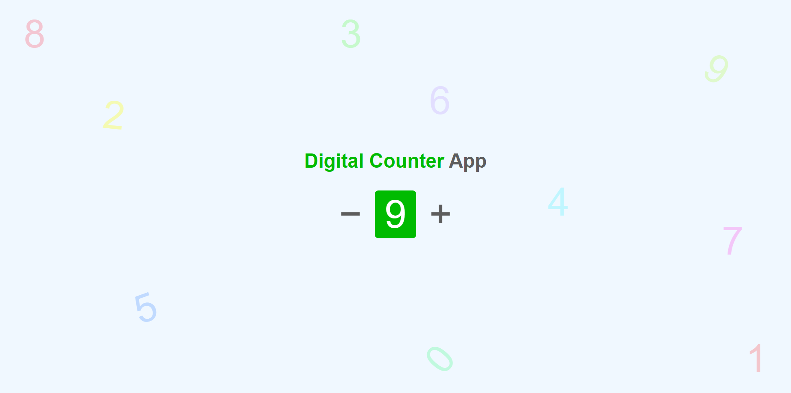

# A9. Digital Counter App

**Digital Counter App** is to show the working of digital counter on addition and subtraction.

## Table of contents

- [Overview](#overview)
  - [Snapshots](#snapshots)
  - [Links](#links)
- [My process](#my-process)
  - [Built with](#built-with)
  - [Concepts Used](#concepts-used)
  - [Continued development](#continued-development)
  - [Useful resources](#useful-resources)
- [Author](#author)

## Overview

A digital counter, where you can start from `zero` (**0**) and add upto `nine` (**9**) using Plus (**+**) sign.

Using Minus (**-**) sign, you can go back to `zero` (**0**) again.

Also, if you continue with Plus (**+**) sign after `nine` (**9**), display digit become `zero` (**0**) again.

### Snapshots

**Primary counter screen : Lower limit**

**During number addition :**

**Higher limit :**

### Links

- Solution URL: [Source Code](https://github.com/SoniBasant/Vanilla-JavaScript-Projects/tree/main/A9.%20Digital%20Counter%20App)

- Live Site URL: [Live Link](https://sonibasant.github.io/Vanilla-JavaScript-Projects/A9.%20Digital%20Counter%20App/Counter.html)

## My process

### Built with

- Semantic HTML5 markup

- CSS custom properties
- Vanilla JavaScript
- Desktop-first workflow
- Flex box

### Concepts Used

- getElementById()

- addEventListener() > click
- if
- .innerText
- .parentElement
- transform: rotate

### Continued development

Your suggestions are welcome. 🙌

### Useful resources

- [w3schools](https://www.w3schools.com) - This helped me throughout my journey. Still doing. 🙂

- [Udemy](https://www.udemy.com/course/50-projects-50-days/) - On DOM part 🤝
- [freecodecamp](https://www.freecodecamp.org/) - All the problems I solved. Helped me a lot. 🙌

## Author

Basant Soni 👨‍💻

- GitHub - [@SoniBasant](https://github.com/SoniBasant)

- Frontend Mentor - [@SoniBasant](https://www.frontendmentor.io/profile/SoniBasant)
- CodePen - [@SoniBasant](https://codepen.io/sonibasant)
- Hashnode - [@SoniBasant](https://sonibasant.hashnode.dev/)
