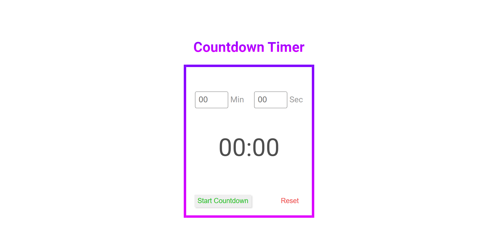
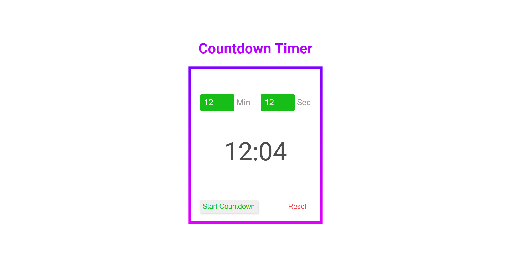
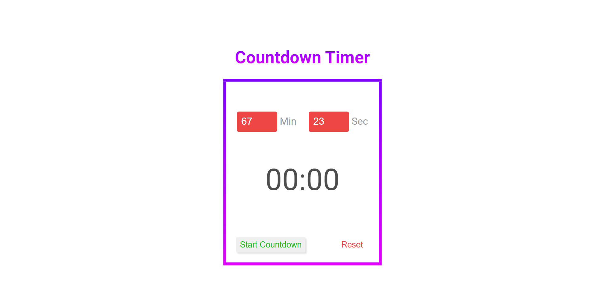

# B0. Countdown-Timer

**Countdown-Timer** is a digital clock for the countdown.

## Table of contents

- [Overview](#overview)
  - [Snapshots](#snapshots)
  - [Links](#links)
- [My process](#my-process)
  - [Built with](#built-with)
  - [Concepts Used](#concepts-used)
  - [Continued development](#continued-development)
  - [Useful resources](#useful-resources)
- [Author](#author)

## Overview

In this **Countdown Timer**, you can start timer with a valid time upto `59 Min` and `60 Sec` (means 1 hour). You need to give minute and second seperately.

If any of them is over the limit, input display become `red` and timer will not start. And if both of them is correct, timer will start and input display become `green`.

There is also a `Reset` button. All the parameters sets to initial position when you click it.

### Snapshots

**Primary Counterdown Timer Screen :**

**Timer after giving time :**

**Timer after giving INCORRECT minutes :**

**Timer after giving INCORRECT seconds :**

### Links

- Solution URL: [Source Code](https://github.com/SoniBasant/Vanilla-JavaScript-Projects/tree/main/B0.%20Countdown-Timer)

- Live Site URL: [Live Link](https://sonibasant.github.io/Vanilla-JavaScript-Projects/B0.%20Countdown-Timer/countDown.html)

## My process

App title have linear-gradient colour. Same with the border.

### Built with

- Semantic HTML5 markup

- CSS custom properties
- Vanilla JavaScript
- Desktop-first workflow
- Flex box

### Concepts Used

- getElementById()

- addEventListener() > click
- if...else
- .value
- .innerHTML
- .classList.remove
- .classList.add
- Ternary operator
- string method > toString(), padStart()
- parseInt()
- Math.floor
- :root
- linear-gradient()

Some **important** concepts -

- clearInterval()

- setInterval()
- -webkit-background-clip
- -webkit-text-fill-color
- border-image-slice

### Continued development

As time reach to the last 10 seconds, display time should change backgound and font color.

Need to work on UI/UX, background design.

Your suggestions are welcome. 🙌

### Useful resources

- [w3schools](https://www.w3schools.com) - This helped me throughout my journey. Still doing. 🙂

- [Udemy](https://www.udemy.com/course/50-projects-50-days/) - On DOM part 🤝
- [freecodecamp](https://www.freecodecamp.org/) - All the problems I solved. Helped me a lot. 🙌
- [Google API](https://fonts.googleapis.com/css2?family=Roboto:wght@400;700&display=swap) - For Font Roboto 🆎

## Author

Basant Soni 👨‍💻

- GitHub - [@SoniBasant](https://github.com/SoniBasant)

- Frontend Mentor - [@SoniBasant](https://www.frontendmentor.io/profile/SoniBasant)
- CodePen - [@SoniBasant](https://codepen.io/sonibasant)
- Hashnode - [@SoniBasant](https://sonibasant.hashnode.dev/)
