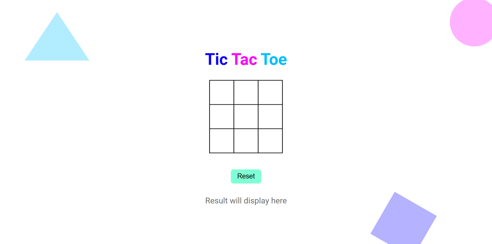
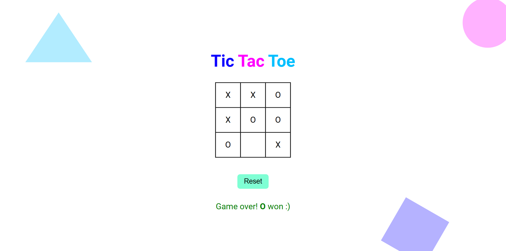
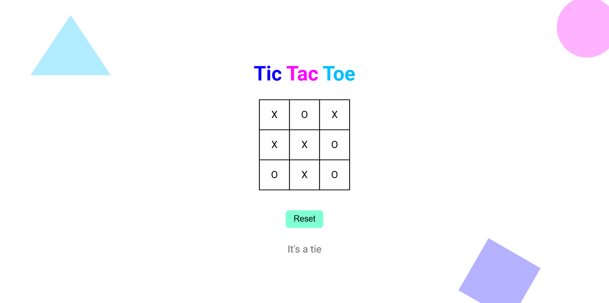

# B1. Tic-Tac-Toe

**Tic-Tac-Toe** is a popular game for two players. Also known as _Cross and Circle_ game.

## Table of contents

- [Overview](#overview)
  - [Snapshots](#snapshots)
  - [Links](#links)
- [My process](#my-process)
  - [Built with](#built-with)
  - [Concepts Used](#concepts-used)
  - [Continued development](#continued-development)
  - [Useful resources](#useful-resources)
- [Author](#author)

## Overview

In **Tic-Tac-Toe**, there is a graph of 3 x 3, total 9 boxes. You need to click on the boxes. The first click make `X` and the second make `O` on the boxes. Choose carefully as you can't undo your action.

If any combination from vertical, horizontal or diagonal have either `X` or `O` in all boxes, that one will win. If there is no combination and no box is empty, game end in a tie. In any condition, you will see the result on screen.

Using **Reset** button, you can play again.

### Snapshots

**Primary Game Screen :**

**X won the game :**

**O won the game :**

**Game end in a tie :**

### Links

- Solution URL: [Source Code](https://github.com/SoniBasant/Vanilla-JavaScript-Projects/tree/main/B1.%20Tic-Tac-Toe%20Game)

- Live Site URL: [Live Link](https://sonibasant.github.io/Vanilla-JavaScript-Projects/B1.%20Tic-Tac-Toe%20Game/ticTT.html)

## My process

First I made blocks. Using DOM, I added `X` in blocks on click event. With if-else, `O` was added on alternate click. Again with if condition, I ensured that any box which is already filled, don't change input on click.

Now come the part where I need place value of boxes, which will be used to compare with winning combinations. I made an `array` of all winning combinations. So for the place value, I added `data-value` in each box in HTML. With `getAttribute` I get those values on `click` event and add them in an array. There are seperate arrays for `X` and `O`.

When array length reach 3, I start comparing them with winning combinations using `for-of` loop. For this, I use a seperate function which take two parameters. One is a winning combination array and second is input value array.

As per the result of comparison, using another function which take result of comparison and player type, we can see the result of the match; whether `X` won, `O` won or match ended in a tie.

With `addEventListener` on **Reset** button, a function will reset all parameters to initial positions.

### Built with

- Vanilla JavaScript

- Semantic HTML5 markup
- CSS custom properties
- Desktop-first workflow
- Flex box

### Concepts Used

- getElementById()

- querySelectorAll()
- addEventListener() > click
- if...else
- array
- forEach() loop
- .innerHTML
- getAttribute()
- for-of loop
- Ternary operator
- Template literals

Some **important** concepts -

- array method > push(), length(), every(), includes()

- data attribute

### Continued development

We can do lots of things in this game.

- A timer > so that there is limited time decide and click

- Multi login > so that two people can play while at different location
- One player Game > Other is Computer
- 3 or 5 games to decide winner
- Championship > Multi games, different levels

As much as you can think. 🚀

Need to work on UI/UX, background design.

Your suggestions are welcome. 🙌

### Useful resources

- [w3schools](https://www.w3schools.com) - This helped me throughout my journey. Still doing. 🙂

- [Udemy](https://www.udemy.com/course/50-projects-50-days/) - On DOM part 🤝
- [freecodecamp](https://www.freecodecamp.org/) - All the problems I solved. Helped me a lot. 🙌
- [Google API](https://fonts.googleapis.com/css2?family=Roboto:wght@400;700&display=swap) - For Font Roboto 🆎

## Author

Basant Soni 👨‍💻

- GitHub - [@SoniBasant](https://github.com/SoniBasant)

- Frontend Mentor - [@SoniBasant](https://www.frontendmentor.io/profile/SoniBasant)
- CodePen - [@SoniBasant](https://codepen.io/sonibasant)
- Hashnode - [@SoniBasant](https://sonibasant.hashnode.dev/)
