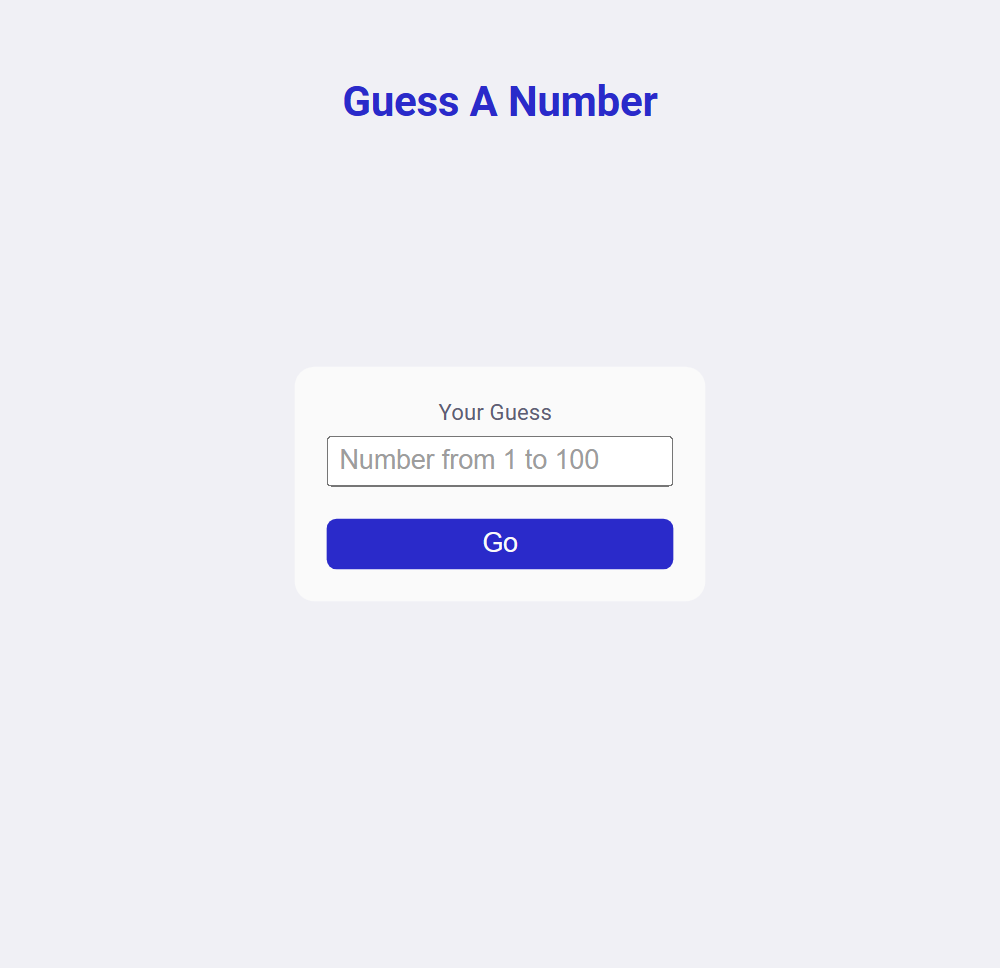
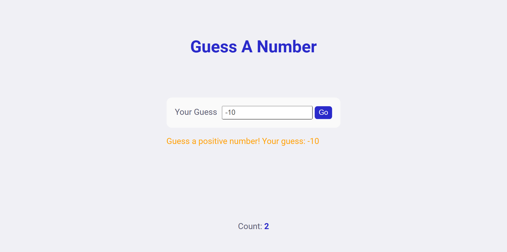
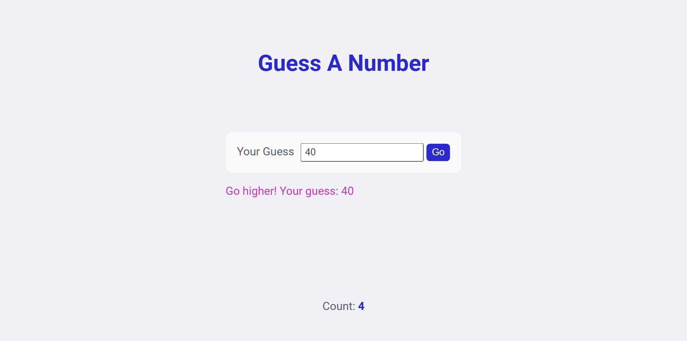
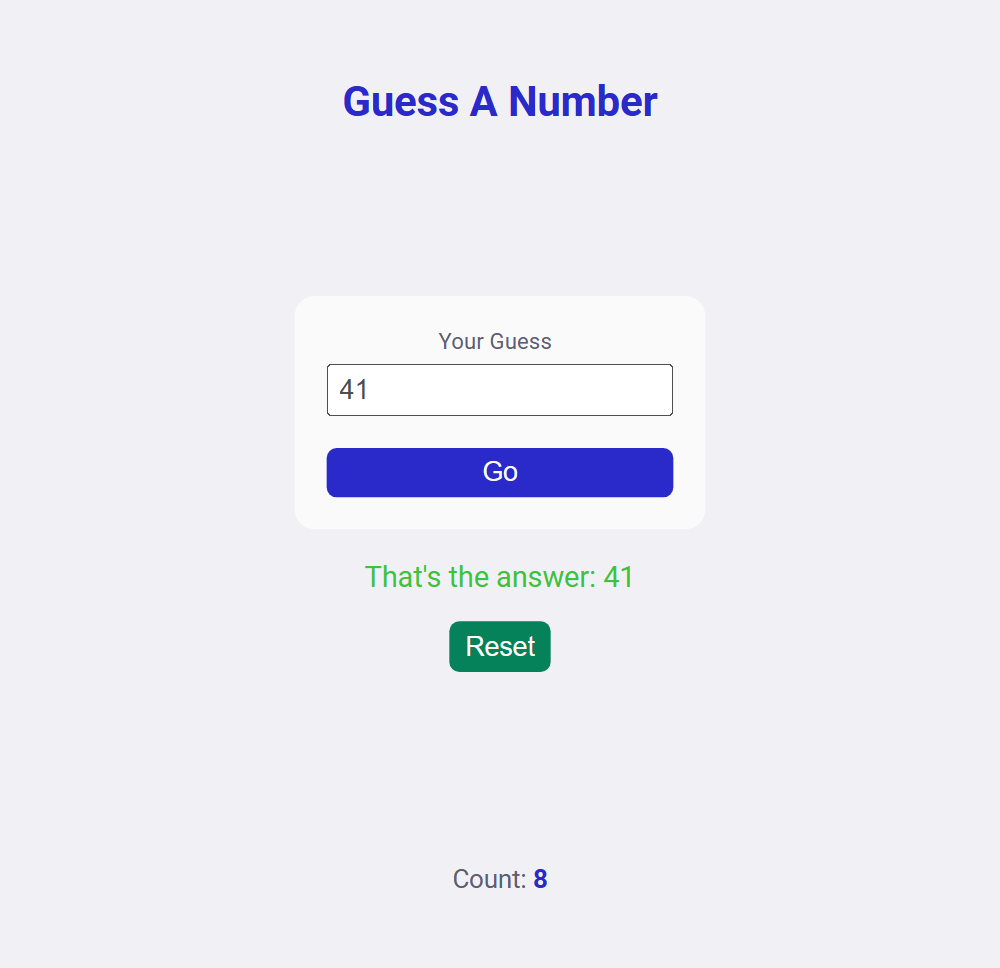

# B2. Guess A Number

**Guess A Number** is a game between computer and human. Computer will generate a random numbera and we human need to guess it. You will be guided throughout the game with messages and can see your number of attempts.

## Table of contents

- [Overview](#overview)
  - [Snapshots](#snapshots)
  - [Links](#links)
- [My process](#my-process)
  - [Built with](#built-with)
  - [Concepts Used](#concepts-used)
  - [Continued development](#continued-development)
  - [Useful resources](#useful-resources)
- [Author](#author)

## Overview

In **Guess A Number**, a `random` number (from 1 to 100; both included), is generated by computer. You need to guess the number. You can try as much time as you want.

Your input should be a positive number, you will be informed with a **message** if that happen.

If your guess is lower or higher, you will be informed accordingly.

And when your guess match with the random number generated, a **Reset** button will appear so that you can play again.

There is a **counter** at the bottom of the page to display number of attempts. It will show when you start playing;

### Snapshots

**Primary Game Screen: Mobile Screen >**

**When guess is negative number: Desktop Screen >**

**When guess is higher: Desktop Screen >**

**When guess is right: Mobile Screen >**

### Links

- Solution URL: [Source Code](https://github.com/SoniBasant/Vanilla-JavaScript-Projects/tree/main/B2.%20Guess%20A%20Number)

- Live Site URL: [Live Link](https://sonibasant.github.io/Vanilla-JavaScript-Projects/B2.%20Guess%20A%20Number/guess_num.html)

## My process

After initial setup, I generate a `random` number. Make a function to check all the `conditions` and call it with the `event` of click on button.

In the function, first I `get` the input `value`, your guess. This is inside function because if I try to get it before click event, we will get a default value and not the input value.

About the `conditions`, I checked if input -

- lower than 0
- higher than 100
- lower than random number
- higher than random number
- any kind of other invalid input

You will see a `message` on different colours when these conditions are true.

- equal to guess value

When your answer is right, you will see a `message` as well as a `reset` button to play again. I used **location.reload()** to reload the page.

In the game, you will see your guess attempts as `count` at the bottom of the page.

### Built with

- Vanilla JavaScript

- Semantic HTML5 markup
- CSS custom properties
- Desktop-first workflow
- Flex box
- Responsive on Mobile Screen

### Concepts Used

- getElementById()

- addEventListener() > click
- if...else
- .innerHTML
- Template literals
- Math.floor()
- Math.random()
- e.preventDefault()
- .value
- :focus
- :root
- ::placeholder
- @media screen

Some **important** concepts -

- location.reload()

- ::-webkit-inner-spin-button
- ::-webkit-outer-spin-button

### Continued development

Need to work on UI/UX, background design. 🚀

Your suggestions are welcome. 🙌

### Useful resources

- [w3schools](https://www.w3schools.com) - This helped me throughout my journey. Still doing. 🙂

- [Udemy](https://www.udemy.com/course/50-projects-50-days/) - On DOM part 🤝
- [freecodecamp](https://www.freecodecamp.org/) - All the problems I solved. Helped me a lot. 🙌
- [Google API](https://fonts.googleapis.com/css2?family=Roboto:wght@400;700&display=swap) - For Font Roboto 🆎

## Author

Basant Soni 👨‍💻

- GitHub - [@SoniBasant](https://github.com/SoniBasant)

- Frontend Mentor - [@SoniBasant](https://www.frontendmentor.io/profile/SoniBasant)
- CodePen - [@SoniBasant](https://codepen.io/sonibasant)
- Hashnode - [@SoniBasant](https://sonibasant.hashnode.dev/)
